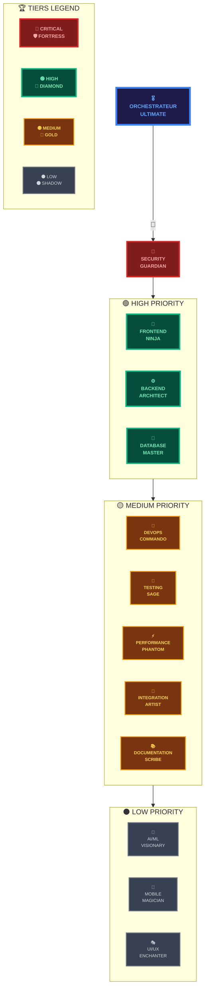

# 🌍 SWARM INTELLIGENCE
## *Plateforme Multi-Agent avec KiloCode CLI*

<div align="center">


</div>

**L'IA Multi-Agent Révolutionne Votre Productivité**

- 🚀 **90% plus rapide** avec parallélisme intelligent
- 🎯 **12 agents spécialisés** pour chaque domaine
- 💎 **100% gratuit** avec support technique
- 🌍 **Adaptable** à tous les secteurs d'activité

---

## 🎯 CRÉATION D'UN SWARM EN 20 MINUTES

### Étape 1: Installation et Configuration (2 minutes)
```bash
# Cloner le projet
git clone https://github.com/DeamonDev888/SWARM-INTELLIGENCE.git
cd SWARM-INTELLIGENCE

# Créer la structure de répertoire
mkdir -p .kilocode/agents scripts
```

### Étape 2: Configuration des Agents (8 minutes)
Créer le fichier `kilocode-agents.json` :
```json
{
  "orchestrator": {
    "id": "orchestrator",
    "role": "Swarm Coordinator",
    "priority": "critical",
    "capabilities": ["coordination", "delegation", "optimization"]
  },
  "agents": [
    {
      "id": "frontend-guru",
      "role": "Frontend Expert",
      "priority": "high",
      "capabilities": ["React", "Vue", "Angular", "UI/UX"]
    },
    {
      "id": "backend-wizard", 
      "role": "Backend Expert",
      "priority": "high",
      "capabilities": ["Node.js", "Python", "APIs", "Databases"]
    },
    {
      "id": "ai-specialist",
      "role": "AI/ML Specialist", 
      "priority": "medium",
      "capabilities": ["Machine Learning", "AI Models", "Data Science"]
    },
    {
      "id": "security-guardian",
      "role": "Security Expert",
      "priority": "critical", 
      "capabilities": ["Security Audit", "Authentication", "Encryption"]
    },
    {
      "id": "testing-expert",
      "role": "QA Specialist",
      "priority": "medium",
      "capabilities": ["Unit Tests", "E2E Tests", "Automation"]
    },
    {
      "id": "devops-commander",
      "role": "DevOps Engineer",
      "priority": "medium",
      "capabilities": ["CI/CD", "Deployment", "Monitoring"]
    }
  ]
}
```

### Étape 3: Lancement du Swarm (10 minutes)
```bash
# Configuration du provider
export KILOCODE_PROVIDER=minimax
export KILOCODE_MODEL=minimax/minimax-m2:free

# Lancement du swarm
kilocode -m orchestrator --agents @kilocode-agents.json --parallel

# Pour un workflow séquentiel
kilocode -m orchestrator --agents @kilocode-agents.json --sequential

# Mode hybride pour développement
kilocode -m orchestrator --agents @kilocode-agents.json --hybrid
```

**✅ Votre swarm de 12 agents spécialisés est actif en 20 minutes !**

---

## 🚀 DÉMARRAGE RAPIDE

### 1. Installation
```bash
git clone https://github.com/DeamonDev888/SWARM-INTELLIGENCE.git
cd SWARM-INTELLIGENCE
```

### 2. Configuration
```bash
mkdir -p .kilocode/agents scripts
# Utilisez le fichier kilocode-agents.json fourni
```

### 3. Lancement
```bash
kilocode -m orchestrator --agents @kilocode-agents.json --parallel
```

**✅ Votre swarm est actif en 20 minutes !**

---

## 🧠 MODÈLES IA SUPPORTÉS

| Modèle | Fournisseur | Description | Coût |
|--------|-------------|-------------|------|
| **minimax/minimax-m2:free** | MiniMax | Modèle reasoning gratuit | $0.00 |
| **x-ai/grok-code-fast-1** | xAI | Génération de code ultra-rapide | $0.00 |

### Configuration des Modèles
```bash
# Pour utiliser MiniMax M2
export KILOCODE_PROVIDER=minimax
export KILOCODE_MODEL=minimax/minimax-m2:free

# Pour utiliser xAI Grok
export KILOCODE_PROVIDER=xai  
export KILOCODE_MODEL=x-ai/grok-code-fast-1
```

---

## 🏗️ ARCHITECTURE DU SWARM

### Hiérarchie des Agents



#### Vue Arborescente Textuelle
```
🏛️ ORCHESTRATEUR CENTRAL
╠═ 🔒 CRITIQUE (1 agent)
║   ╚═ Security Guardian
║       ╠═ 🟢 HIGH (3 agents)
║       ║   ├─ Frontend Expert
║       ║   ├─ Backend Expert
║       ║   └─ Database Master
║       ║       ╠═ 🟣 MEDIUM (5 agents)
║       ║       ║   ├─ DevOps Engineer
║       ║       ║   ├─ Testing Expert
║       ║       ║   ├─ Performance Optimizer
║       ║       ║   ├─ Integration Specialist
║       ║       ║   └─ Documentation Expert
║       ║       ║       ╚═ ⚪ LOW (3 agents)
║       ║       ║           ├─ AI/ML Specialist
║       ║       ║           ├─ Mobile Expert
║       ║       ║           └─ UI/UX Designer
║       ╚═ 🧵 CROSS-CUTTING
║           ├─ 🔄 Ordonnancement Intelligent
║           ├─ 📊 Monitoring & Métriques
║           └─ 🔐 Sécurité Intégré
```

### Stratégies d'Exécution

| Mode | Agents | Temps | Usage |
|------|--------|-------|-------|
| **Parallel** | 12 | 2-5 min | Démarrage rapide, tests |
| **Sequential** | 12 | 15-30 min | Workflows complexes |
| **Hybrid** | 12 | 5-10 min | Développement production |
| **Critical-First** | 3 | 1-2 min | Urgence, hotfix |

---

## 💡 CAS D'USAGE UNIVERSELS

### Développement Full-Stack (45 min vs 8h)
```bash
# Lancement avec agents spécialisés
kilocode -m orchestrator --agents @kilocode-agents.json --parallel \
  "Créer une application web complète avec React + Node.js + PostgreSQL"
```

### Migration de Base de Données (30 min)
```bash
# Orchestrateur coordonne la migration
kilocode -m orchestrator --sequential \
  "Migrer MySQL vers PostgreSQL avec preservation des données"
```

### Développement d'API (20 min)
```bash
# Agents backend + database
kilocode -m orchestrator --agents @kilocode-agents.json --parallel \
  "Développer API REST avec authentification et CRUD"
```

### Audit de Sécurité (15 min)
```bash
# Focus sur l'agent security
kilocode -m orchestrator --agents @kilocode-agents.json \
  "Audit complet de sécurité de l'application"
```

---

## ⚡ COMMANDES ESSENTIELLES

### Modes CLI Principaux
```bash
# Architecture et planification
kilocode -m architect "Concevoir l'architecture d'une app React"

# Génération de code  
kilocode -m code "Créer un composant React avec hooks"

# Questions et assistance
kilocode -m ask "Meilleures pratiques React 2025"

# Débogage système
kilocode debug os  # Diagnostic complet
kilocode debug keyboard  # Test périphériques

# Orchestration complexe
kilocode -m orchestrator "Développer une API complète"
```

### Options Avancées
```bash
# Mode autonome (CI/CD)
kilocode -m code --auto "Générer tests unitaires"

# Parallélisme  
kilocode -m code --parallel "Créer composants UI"

# Continuité de session
kilocode --continue -m code "Améliorer la fonction"

# Workspace spécifique
kilocode -w ./frontend -m code "Créer dashboard"
```

---

## 📞 SUPPORT

- 🌐 **Site web** : [swarm-intelligence.onrender.com](https://swarm-intelligence.onrender.com/)
- 💬 **Discord** : [discord.gg/Jt83jBebsk](https://discord.gg/Jt83jBebsk)
- 📧 **Email** : support@kilocode.ai
- 📖 **Documentation** : [docs.kilocode.org](https://docs.kilocode.org)
- 🛠️ **Exemples** : [github.com/Kilo-Org/kilocode-examples](https://github.com/Kilo-Org/kilocode-examples)

---

## 🎯 WORKFLOWS PRATIQUES

### Développement Itératif (Mode Recommandé)
```bash
# Étape 1: Architecture
kilocode -m architect --auto "Architecture microservices e-commerce"

# Étape 2: Frontend  
kilocode -m code --continue "Interface utilisateur React"

# Étape 3: Backend
kilocode -m code --continue "API Node.js avec JWT"

# Étape 4: Tests
kilocode -m orchestrator --agents @kilocode-agents.json \
  "Tests E2E et déploiement"
```

### Résolution de Problèmes
```bash
# Diagnostic système
kilocode debug os

# Orchestration pour résolution
kilocode -m orchestrator --sequential \
  "Analyser et résoudre le problème de performance"
```

---

*Propulsé par KiloCode CLI - Révolutionnez votre workflow de développement*

**🐝 Transformez 8 heures de travail en 45 minutes avec l'intelligence collective !**
